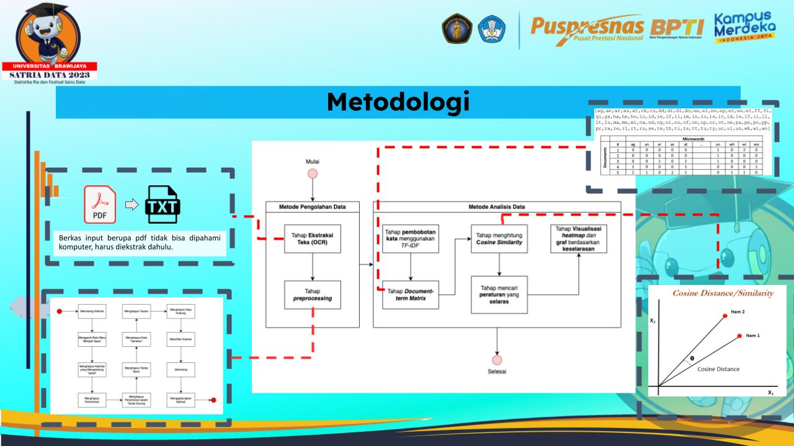

# Text Analytics Using TF-IDF for Identifying Regulatory Alignment in Indonesia's Investment Sector

## Overview
This project aims to analyze the alignment of legislation within the scope of investment in Indonesia using the TF-IDF (Term Frequency-Inverse Document Frequency) method. It addresses the challenge of numerous and often complex regulations affecting the investment landscape in Indonesia.

## Background
The project originated from the need to assess the harmony between various legislations, an important aspect given the complexity and frequent revisions in regulations.

## Methodology

The methodology involves several steps:
- Text extraction from legal documents.
- Text preprocessing, including text conversion, line break replacement, and removal of non-essential elements.
- Application of the TF-IDF algorithm for text analysis.
- Visualization using heatmaps and graphs.

## Results
The project successfully implements the TF-IDF algorithm, providing an effective and scalable approach to analyzing legal documents. It also introduces a user-friendly interface that doesn't require coding knowledge, accessible anytime and anywhere.

[Project Demo](https://legal-app.streamlit.app/)

## Future Scope
Future enhancements could include integrating POS-Tagging, Named Entity Recognition (NER), and Dependency Parsing. Additionally, exploring other similarity algorithms like Jaccard, Euclidean, or Manhattan distance is suggested for further evaluation steps.

## Conclusion
TF-IDF is a robust method for analyzing regulatory alignment in investment-related legislations in Indonesia. The project provides useful insights and visualizations, making it a valuable tool for legal analysis.
